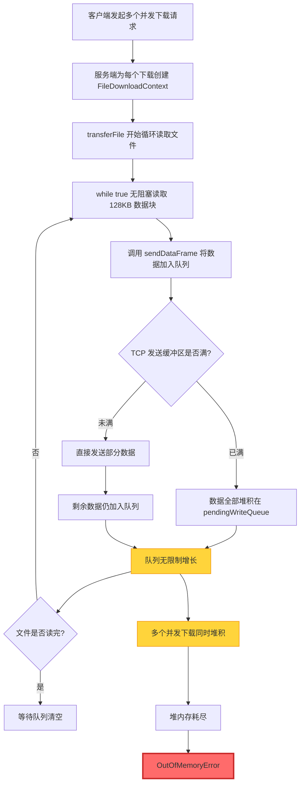

# 文件下载 OutOfMemoryError 问题分析

## 问题现象

根据错误截图显示：
- **异常类型**: `java.lang.OutOfMemoryError: Java heap space`
- **发生位置**: `FileDownloadHandler` 文件传输过程中
- **触发场景**: 客户端并发下载多个文件时

---

## 根本原因分析

### 1. **缺乏有效的应用层流控机制**

> [!CAUTION]
> **核心问题**: 服务端在文件传输时采用"无脑发送"策略，没有等待客户端的接收确认就持续读取文件并将数据帧加入发送队列，导致内存中积压大量待发送数据。

#### 问题代码位置

[FileDownloadHandler.java:L268-L301](file:///Users/hljy/IdeaProjects/code/net-server/src/main/java/com/alibaba/server/nio/service/file/handler/FileDownloadHandler.java#L268-L301)

```java
private void transferFile(FileDownloadContext context,
        SocketChannelContext socketChannelContext,
        SimpleChannelContext simpleChannelContext) throws IOException {
    
    // 分块读取并发送 - 使用直接缓冲区减少内存拷贝
    int bufferSize = 131072; // 128KB
    ByteBuffer readBuffer = ByteBuffer.allocate(bufferSize);

    while (true) {
        readBuffer.clear();
        int bytesRead = context.readChunk(readBuffer);

        if (bytesRead == -1) {
            break; // 文件读取完毕
        }

        if (bytesRead > 0) {
            readBuffer.flip();
            byte[] data = new byte[readBuffer.remaining()];
            readBuffer.get(data);
            sendDataFrame(socketChannelContext, data);  // ⚠️ 关键问题点

            // 简单的流控，防止发送过快撑爆内存（实际应配合WriteQueueHelper的流控机制）
            // 这里不做 sleep，依赖 NIO 队列
        }
    }
}
```

**问题分析**:
1. **循环无阻塞**: `while(true)` 循环持续从文件读取数据
2. **立即发送**: 每次读取后立即调用 `sendDataFrame()` 将数据加入队列
3. **无等待机制**: 没有检查发送队列状态，不等待客户端确认
4. **注释自相矛盾**: 代码注释提到"简单的流控"，但实际上没有任何流控逻辑

---

### 2. **发送队列无限制堆积**

#### WriteQueueHelper 的工作机制

[WriteQueueHelper.java:L36-L98](file:///Users/hljy/IdeaProjects/code/net-server/src/main/java/com/alibaba/server/nio/handler/event/concret/WriteQueueHelper.java#L36-L98)

```java
public static void submitWrite(SocketChannelContext socketChannelContext, ByteBuffer buffer) {
    java.util.concurrent.ConcurrentLinkedQueue<ByteBuffer> queue = 
        socketChannelContext.getPendingWriteQueue();

    synchronized (queue) {
        // 1. 先处理队列中已有的待写数据
        ByteBuffer pending;
        while ((pending = queue.peek()) != null) {
            int written = socketChannel.write(pending);
            if (pending.hasRemaining()) {
                // 队列头的数据没写完，新数据入队尾
                ByteBuffer copy = ByteBuffer.allocate(buffer.remaining());
                copy.put(buffer);
                copy.flip();
                queue.offer(copy);  // ⚠️ 无限制加入队列
                registerWriteInterest(socketChannelContext);
                return;
            }
            queue.poll();
        }

        // 2. 队列空了，尝试直接写入新数据
        int written = socketChannel.write(buffer);

        // 3. 如果没写完，加入队列并注册 OP_WRITE
        if (buffer.hasRemaining()) {
            ByteBuffer copy = ByteBuffer.allocate(buffer.remaining());  // ⚠️ 堆内存分配
            copy.put(buffer);
            copy.flip();
            queue.offer(copy);  // ⚠️ 无限制加入队列
            registerWriteInterest(socketChannelContext);
        }
    }
}
```

**问题分析**:
1. **无队列大小限制**: `ConcurrentLinkedQueue` 没有容量上限
2. **内存拷贝**: 每次都创建新的 `ByteBuffer` 并拷贝数据
3. **无背压机制**: 当 TCP 发送缓冲区满时，数据会持续堆积在队列中

#### SocketChannelContext 的队列定义

[SocketChannelContext.java:L64](file:///Users/hljy/IdeaProjects/code/net-server/src/main/java/com/alibaba/server/nio/model/SocketChannelContext.java#L64)

```java
/**
 * 待写入的缓冲区队列（支持多个待写数据排队）
 * 使用队列避免快速连续调用时数据丢失
 */
private java.util.concurrent.ConcurrentLinkedQueue<java.nio.ByteBuffer> pendingWriteQueue = 
    new java.util.concurrent.ConcurrentLinkedQueue<>();
```

---

### 3. **并发下载场景下的内存爆炸**

#### 内存累积计算

假设场景：
- **并发下载数**: 10 个文件
- **单文件大小**: 100 MB
- **网络带宽瓶颈**: 客户端接收速度 1 MB/s
- **服务端读取速度**: 磁盘读取速度 100 MB/s（远超网络发送速度）

**内存占用分析**:

| 时间点 | 每个下载任务队列积压 | 10个并发任务总积压 | 说明 |
|--------|---------------------|-------------------|------|
| 1秒后 | ~99 MB | ~990 MB | 读取100MB，发送1MB |
| 2秒后 | ~100 MB | ~1000 MB | 队列已满载文件数据 |
| 持续状态 | 100 MB | 1 GB+ | 内存持续高位运行 |

> [!WARNING]
> **关键问题**: 服务端读取文件速度远超网络发送速度，导致大量数据在内存队列中堆积。每个并发下载都会独立占用大量内存，多个并发下载会导致内存快速耗尽。

---

### 4. **waitForQueueDrain 的时机问题**

[FileDownloadHandler.java:L303-L305](file:///Users/hljy/IdeaProjects/code/net-server/src/main/java/com/alibaba/server/nio/service/file/handler/FileDownloadHandler.java#L303-L305)

```java
// 等待所有 DATA_FRAME 发送完成（无限等待，但如果30秒无进展则认为卡死）
log.info("等待所有数据帧发送完成...");
WriteQueueHelper.waitForQueueDrain(socketChannelContext, 30000); // 30秒无进展超时
```

**问题分析**:
- **等待时机错误**: 在 `while` 循环**之后**才等待队列清空
- **为时已晚**: 此时所有文件数据已经读入内存并加入队列
- **内存已爆**: OOM 已经在循环过程中发生，根本等不到这一步

---

## 内存溢出的完整链路



---

## 解决方案建议

### 方案一：实现应用层流控（推荐）

> [!IMPORTANT]
> **核心思路**: 在发送数据前检查队列大小，当队列积压超过阈值时暂停读取文件，等待队列消化后再继续。

#### 实现步骤

1. **定义队列大小阈值**
   ```java
   // 最大允许队列中待发送的缓冲区数量
   private static final int MAX_PENDING_BUFFERS = 50;  // 50 * 128KB = 6.4MB
   ```

2. **修改 transferFile 方法**
   ```java
   while (true) {
       // ✅ 流控检查：等待队列消化
       ConcurrentLinkedQueue<ByteBuffer> queue = socketChannelContext.getPendingWriteQueue();
       while (queue.size() > MAX_PENDING_BUFFERS) {
           log.debug("队列积压过多({})，暂停读取，等待发送...", queue.size());
           Thread.sleep(50);  // 等待 50ms
           
           // 检查通道是否仍然打开
           if (!socketChannelContext.getSocketChannel().isOpen()) {
               throw new IOException("通道已关闭");
           }
       }

       readBuffer.clear();
       int bytesRead = context.readChunk(readBuffer);
       
       if (bytesRead == -1) {
           break;
       }

       if (bytesRead > 0) {
           readBuffer.flip();
           byte[] data = new byte[readBuffer.remaining()];
           readBuffer.get(data);
           sendDataFrame(socketChannelContext, data);
       }
   }
   ```

**优点**:
- ✅ 简单有效，改动最小
- ✅ 内存占用可控（每个连接最多 6.4MB）
- ✅ 不影响现有架构

**缺点**:
- ⚠️ 使用 `Thread.sleep()` 会阻塞线程

---

### 方案二：基于信号量的流控

使用 `Semaphore` 实现更优雅的流控：

```java
// 在 SocketChannelContext 中添加
private Semaphore sendPermits = new Semaphore(MAX_PENDING_BUFFERS);

// 在 transferFile 中
while (true) {
    // 获取发送许可（阻塞等待）
    sendPermits.acquire();
    
    readBuffer.clear();
    int bytesRead = context.readChunk(readBuffer);
    
    if (bytesRead == -1) {
        sendPermits.release();  // 释放许可
        break;
    }

    if (bytesRead > 0) {
        readBuffer.flip();
        byte[] data = new byte[readBuffer.remaining()];
        readBuffer.get(data);
        sendDataFrame(socketChannelContext, data);
        // 注意：需要在数据实际发送完成后释放 permit
    }
}
```

**优点**:
- ✅ 更优雅的阻塞机制
- ✅ 精确控制并发度

**缺点**:
- ⚠️ 需要在数据发送完成时释放许可，实现复杂
- ⚠️ 需要修改 `WriteQueueHelper` 添加回调机制

---

### 方案三：限制并发下载数量

在应用层限制同时进行的下载任务数：

```java
// 全局下载任务信号量
private static final Semaphore DOWNLOAD_SEMAPHORE = new Semaphore(5);  // 最多5个并发下载

private void handleClientAck(...) {
    try {
        // 获取下载许可
        if (!DOWNLOAD_SEMAPHORE.tryAcquire(5, TimeUnit.SECONDS)) {
            sendErrorFrame(socketChannelContext, "服务器繁忙，请稍后重试");
            return;
        }
        
        try {
            transferFile(context, socketChannelContext, simpleChannelContext);
        } finally {
            DOWNLOAD_SEMAPHORE.release();
        }
    } catch (InterruptedException e) {
        Thread.currentThread().interrupt();
    }
}
```

**优点**:
- ✅ 从源头控制并发，保护服务器资源
- ✅ 实现简单

**缺点**:
- ⚠️ 限制了系统吞吐量
- ⚠️ 不解决单个下载的内存问题

---

### 方案四：使用零拷贝技术（长期优化）

使用 `FileChannel.transferTo()` 实现零拷贝：

```java
private void transferFile(...) throws IOException {
    FileChannel fileChannel = context.getFileChannel();
    SocketChannel socketChannel = socketChannelContext.getSocketChannel();
    
    long position = context.getCurrentOffset();
    long remaining = context.getFileSize() - position;
    
    while (remaining > 0) {
        long transferred = fileChannel.transferTo(position, remaining, socketChannel);
        if (transferred == 0) {
            // TCP 缓冲区满，等待
            Thread.sleep(10);
            continue;
        }
        position += transferred;
        remaining -= transferred;
    }
}
```

**优点**:
- ✅ 零拷贝，性能最优
- ✅ 内存占用最小
- ✅ 利用操作系统底层优化

**缺点**:
- ⚠️ 需要重构现有帧协议
- ⚠️ 无法在应用层控制数据块大小
- ⚠️ 改动较大

---

## 推荐实施方案

### 短期方案（立即实施）

**方案一 + 方案三 组合**:

1. **实现应用层流控**: 在 `transferFile` 中添加队列大小检查
2. **限制并发下载数**: 使用信号量控制同时下载任务数为 3-5 个
3. **调整缓冲区大小**: 将 128KB 降低到 64KB，减少单次内存分配

### 中期方案（优化改进）

1. **实现基于信号量的流控**: 替换 `Thread.sleep()` 方案
2. **添加监控指标**: 记录队列大小、内存占用、传输速率
3. **动态调整**: 根据系统负载动态调整并发数和缓冲区大小

### 长期方案（架构优化）

1. **引入零拷贝技术**: 重构文件传输协议
2. **实现分片下载**: 支持客户端多线程分片下载
3. **添加限流降级**: 基于系统资源动态限流

---

## 总结

> [!CAUTION]
> **问题本质**: 服务端文件读取速度远超网络发送速度，且缺乏应用层流控机制，导致大量数据在内存队列中无限制堆积。并发下载场景下，多个任务同时堆积内存，最终触发 OutOfMemoryError。

**关键改进点**:
1. ✅ **必须实现应用层流控**: 检查队列大小，暂停文件读取
2. ✅ **限制并发下载数**: 保护服务器资源
3. ✅ **监控队列状态**: 及时发现异常堆积
4. ✅ **优化内存使用**: 减小缓冲区大小，考虑使用对象池

**预期效果**:
- 内存占用从 **不可控** 降低到 **可控范围**（每连接 < 10MB）
- 支持更多并发下载而不会 OOM
- 系统稳定性显著提升
